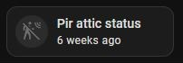

# last_changed_saver.py

This Python script for Home Assistant allows you to save and restore entity last_changed status.

## Requirements
This script requires:
- [PythonScriptsPro](https://github.com/AlexxIT/PythonScriptsPro) - A Home Assistant integration that extends the functionality of Python scripts, enabling file operations and better script execution.
- [Easy Time Jinja](https://github.com/Petro31/easy-time-jinja) - A Jinja extension that simplifies working with timestamps in Home Assistant templates.
- [Mushroom Template Card](https://github.com/piitaya/lovelace-mushroom) or [Template Entity Row](https://github.com/thomasloven/lovelace-template-entity-row) - Custom Lovelace cards for better UI representation of entity states and timestamps.

## Features
- Save the state of specific entities or all entities.
- Restore previously saved entity states.
- Supports wildcard `*` for pattern matching entity IDs.

## Usage

The script takes the following parameters:

| Parameter         | Type   | Description                                                                                                                                       |
|-------------------|--------|---------------------------------------------------------------------------------------------------------------------------------------------------|
| `action`          | string | Required. Can be `save` or `restore`.                                                                                                             |
| `states_location` | string | Optional. The location where the states JSON file is stored. Default: `/config/python_scripts`.                                                   |
| `entities`        | string | Required. Comma-separated list of entity IDs to save/restore. Supports `all` or wildcards (`binary_sensor.pir_*, binary_sensor.pir_*_occupancy`). |

### Example Usage

#### Save all entity states:
```yaml
action: python_script.exec
data:
  action: save
  entities: all
  file: python_scripts/last_changed_saver.py
  states_location: /config/python_scripts
```

#### Save specific entities:
```yaml
action: python_script.exec
data:
  action: save
  entities: "sensor.temperature,switch.living_room"
  file: python_scripts/last_changed_saver.py
  states_location: /config/python_scripts

```

#### Save entities using wildcard:
```yaml
action: python_script.exec
data:
  action: save
  entities: binary_sensor.pir_*_occupancy
  file: python_scripts/last_changed_saver.py
  states_location: /config/python_scripts
```

#### Restore saved entity states:
```yaml
action: python_script.exec
data:
  action: restore
  file: python_scripts/last_changed_saver.py
  states_location: /config/python_scripts
  entities: sensor.temperature,switch.living_room
```

### Home Assistant Automations
#### Save
```yaml
alias: SAVE
description: ""
triggers:
  - event: shutdown
    trigger: homeassistant
    enabled: true
  - trigger: time_pattern
    minutes: "45"
    hours: "*"
conditions: []
actions:
  - action: python_script.exec
    data:
      action: save
      entities: binary_sensor.pir_*_occupancy
      file: python_scripts/last_changed_saver.py
      states_location: /config/python_scripts
mode: single
```

#### Restore
```yaml
alias: RESTORE
description: ""
triggers:
  - event: start
    trigger: homeassistant
actions:
  - delay:
      hours: 0
      minutes: 0
      seconds: 60
      milliseconds: 0
  - action: python_script.exec
    data:
      action: restore
      file: python_scripts/last_changed_saver.py
      states_location: /config/python_scripts
      entities: sensor.temperature,switch.living_room
mode: single
```


## Mushroom Template Card
```yaml
type: custom:mushroom-template-card
primary: Pir attic status
secondary: >-
  
  {{ easy_relative_time(states.binary_sensor.pir_attic_occupancy.last_changed, language='en') }}
icon: mdi:motion-sensor-off
```



## Template Entity Row
```yaml
type: custom:template-entity-row
name: Attic
entity: binary_sensor.pir_attic_occupancy
state: >-
  
  {{ easy_relative_time(states.binary_sensor.pir_attic_occupancy.last_changed, language='en') }}
icon: >-
  {{'mdi:motion-sensor' if is_state('binary_sensor.pir_attic_occupancy', 'on') else 'mdi:motion-sensor-off' }}
```


## Notes
- This script does **not** restore entity states, only timestamps. The actual state values are managed by Home Assistant.
- Ensure Home Assistant has the necessary permissions to read and write the JSON file.
- The `restore` function may not work for all entity types due to Home Assistant limitations.

## Troubleshooting
- If no entities are found when saving, ensure they exist in Home Assistant and are spelled correctly.
- If the restore action fails, verify that the JSON file exists and contains valid data.
- Check Home Assistant logs for error messages related to the script.

---
